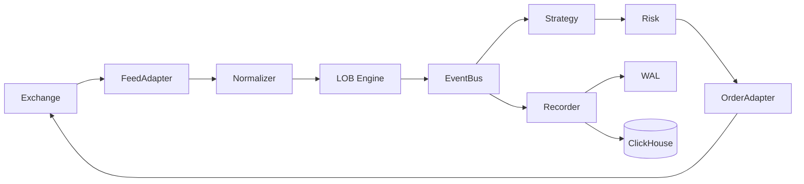

# HFT Platform Architecture

This document describes the *current* architecture and runtime flow.

---

## 1) System Overview

HFT Platform is an event‑driven pipeline:

```
Market Data -> Normalizer -> LOB -> Event Bus -> Strategy -> Risk -> Order -> Broker
                                \-> Recorder -> WAL/ClickHouse
```

Key goals:
- low latency (hot paths in Rust/Numba)
- deterministic timing (minimize blocking I/O)
- observability first (Prometheus metrics everywhere)

---

## 2) Core Components

### 2.1 Feed Adapter
- `feed_adapter/shioaji_client.py`: login, subscribe, reconnect
- `feed_adapter/normalizer.py`: raw → `TickEvent`/`BidAskEvent`
- `feed_adapter/lob_engine.py`: LOB state + stats

### 2.2 Event Bus
- `engine/event_bus.py`: low‑alloc event routing
- supports Rust path and configurable wait modes

### 2.3 Strategy Engine
- `strategy/base.py`: SDK + helpers
- `strategies/*`: strategy implementations
- `strategy/runner.py`: dispatch + batching

### 2.4 Risk & Order
- `risk/validators.py`: policy checks
- `risk/fast_gate.py`: Numba hot‑path gate + kill switch
- `order/adapter.py`: rate limiting, circuit breaker, Shioaji adapter

### 2.5 Execution & Positions
- `execution/router.py`: intents → adapter
- `execution/positions.py`: position tracking / PnL

### 2.6 Recorder
- `recorder/writer.py`: WAL + ClickHouse writes
- `recorder/loader.py`: WAL replay

### 2.7 Observability
- `observability/metrics.py`: Prometheus counters/gauges/histograms

---

## 3) Rust Acceleration

- `rust_core/`: PyO3 extension (normalizer, LOB, hot‑path helpers)
- `rust/`: separate strategy crate for future/native execution

Build (local):
```bash
uv run maturin develop --manifest-path rust_core/Cargo.toml
```

---

## 4) Data Flow (Mermaid)



---

## 5) Storage

- WAL: jsonl files under `.wal/`
- ClickHouse: `hft.market_data`, `hft.orders`, `hft.risk_log`, ...
- Schema: `src/hft_platform/schemas/clickhouse.sql`

---

## 6) Specs

- Simulation spec: `specs/hft_simulation_architecture.md`

---

## 7) Related Docs
- `docs/getting_started.md`
- `docs/config_reference.md`
- `docs/observability_minimal.md`
