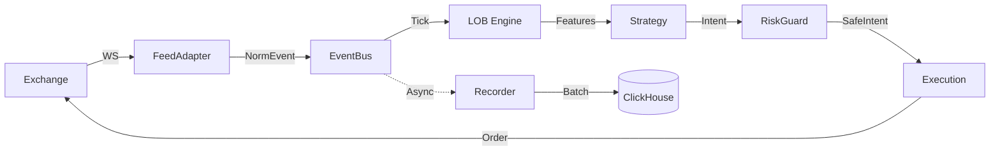

# HFT Platform Architecture

## System Overview
The HFT Platform is an event-driven, low-latency trading system designed for the Taiwan Stock Exchange (TSE/OTC). It emphasizes modularity, type safety, and observability.

## 1. Core Components

### 1.1 Feed Adapter (`feed_adapter/`)
*   **Role**: Connectivity to Exchange (Shioaji).
*   **Responsibility**:
    *   Subscribe to Quotes/Ticks.
    *   Normalize raw API data into internal `MarketEvent` structures.
    *   Publish events to the `EventBus`.

### 1.2 LOB Engine (`feed_adapter/lob_engine.py`)
*   **Role**: State Management.
*   **Responsibility**:
    *   Reconstruct Limit Order Book (LOB) from incremental updates.
    *   Compute L1 Features (Mid, Spread, Imbalance).
    *   **Future**: Rust acceleration (PyO3).

### 1.3 Strategy Engine (`strategy/`, `strategies/`)
*   **Role**: Decision Making.
*   **Responsibility**:
    *   `BaseStrategy`: SDK providing `on_tick`, `buy`, `sell`.
    *   `SimpleMarketMaker`: Implementation of Alpha logic (Micro-Price, Inventory Skew).
    *   **Features**: `features/` library (OFI, Entropy, Fractal) provides signals.

### 1.4 Execution & Order Management (`execution/`, `order/`)
*   **Role**: Market Access.
*   **Responsibility**:
    *   `OrderAdapter`: Lifecycle management (New -> Ack -> Fill).
    *   `RiskGuard`: Pre-trade checks (Max Position, Max Notional).
    *   `ExectuionRunner`: Routes intents to actual API calls.

### 1.5 Persistence (`recorder/`)
*   **Role**: Data Lake.
*   **Technologies**:
    *   **WAL**: Write-Ahead Log for crash recovery.
    *   **ClickHouse**: Columnar storage for tick history and analytics.
    *   **S3**: Tiered storage for cold data (Future).

## 2. Data Flow

## 3. Infrastructure
*   **Runtime**: Docker Compose (App + ClickHouse + Grafana + Prometheus).
*   **Deployment**: GitHub Actions -> GHCR -> Azure VM (SSH).
*   **HA**: Active-Passive Cluster (Planned).

## 4. Key Configurations
*   `config/symbols.yaml`: Universe definition.
*   `config/base/strategies.yaml`: Strategy defaults (use `config/strategies.yaml` for local overrides).
*   `metrics.py`: Prometheus instrumentation.
