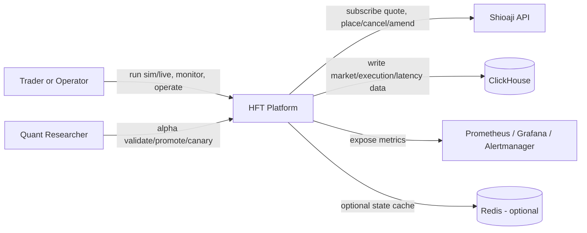
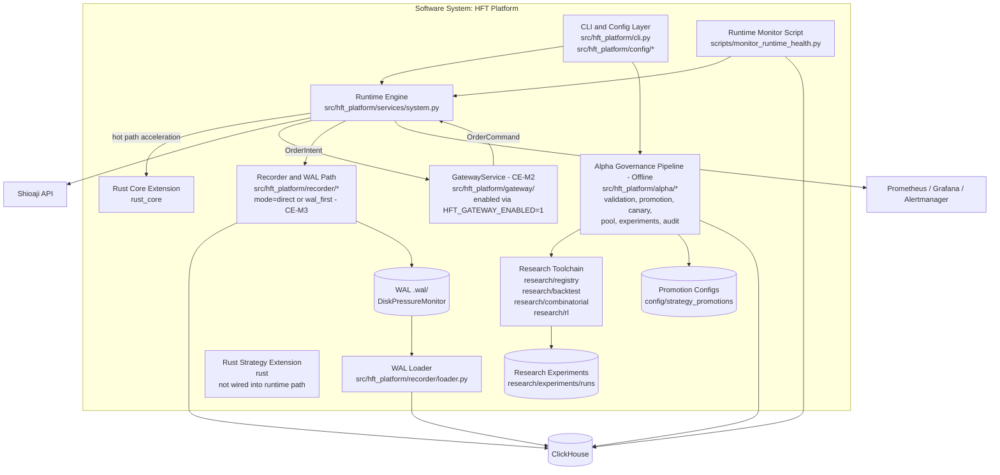
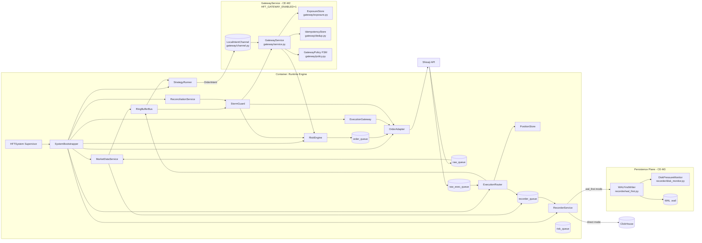
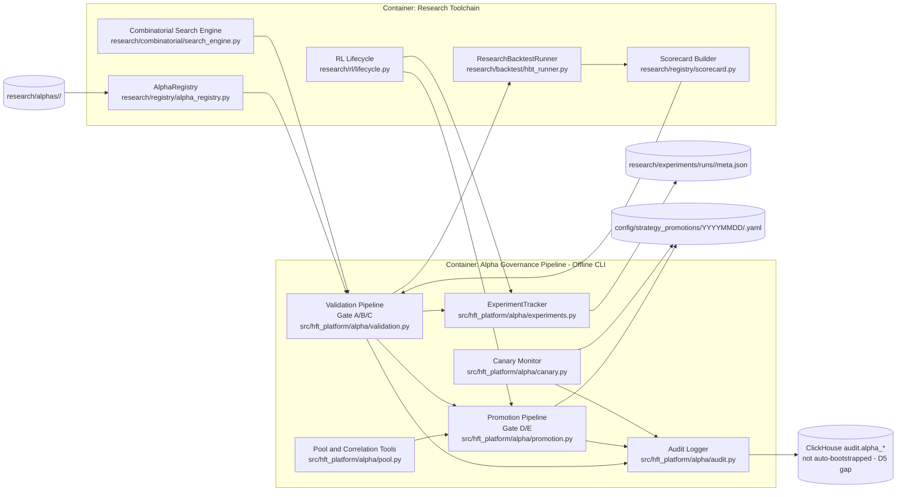
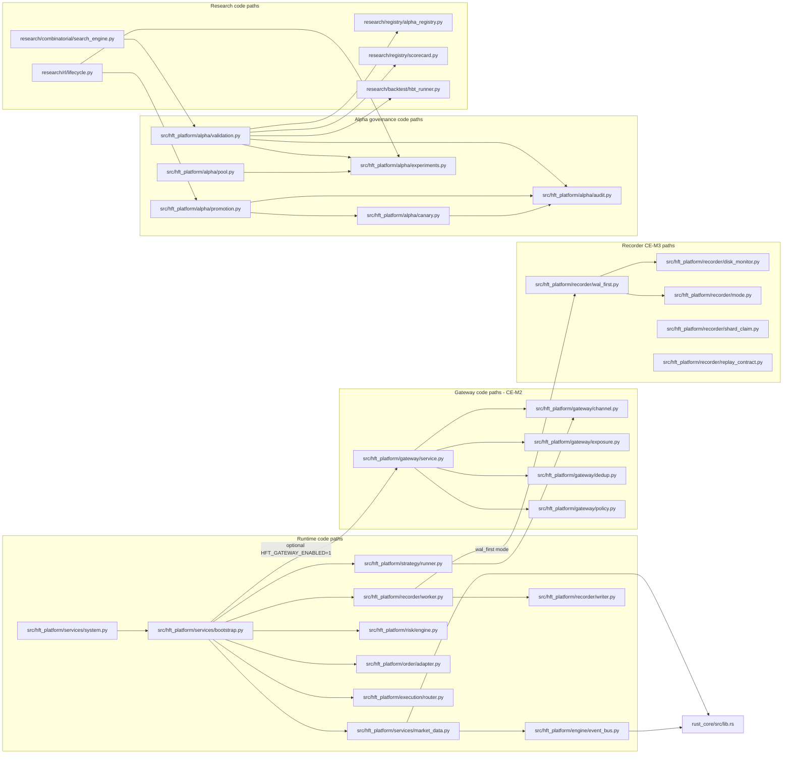

# HFT Platform C4 Model (Current State)

Date: 2026-02-21
Scope: As-built architecture from `src/hft_platform`, `research`, `rust_core`, and `docker-compose.yml`.
Note: CE-M2 (GatewayService) and CE-M3 (WALFirstWriter, DiskPressureMonitor) are implemented as of 2026-02-21.

## 1. C1 - System Context

## 2. C2 - Container Diagram

## 3. C3 - Component Diagram (Runtime Engine)

## 4. C3 - Component Diagram (Alpha and Research Pipeline)

## 5. C4 - Code-Level Dependency Map (Representative)

## 7. Hardening Backlog: CE-M2 (Gateway)

CE-M2 core implemented 2026-02-21. Enabled via `HFT_GATEWAY_ENABLED=1`.
Design review: `.agent/library/design-review-artifacts.md` § CE-M2.
Issue backlog: `.agent/library/cluster-evolution-backlog.md` § 2.

**Hardening TODO checklist**:
- [ ] [CE2-07] Add `gateway_dispatch_latency_ns`, `gateway_reject_total`, `gateway_dedup_hits_total` to Prometheus + dashboard
- [ ] [CE2-08] Chaos test: multi-runner + gateway outage, verify no duplicate broker dispatch
- [ ] [CE2-09] Active/standby gateway HA with leader lease; only leader dispatches to broker
- [ ] [CE2-11] `quote_version=v1` enforced with schema guard and reject-and-alert on mismatch

**Implemented components**:
- `gateway/channel.py` — `LocalIntentChannel` (bounded asyncio queue, ack/nack, DLQ)
- `gateway/exposure.py` — `ExposureStore` (atomic CAS, memory-bounded CE2-12)
- `gateway/dedup.py` — `IdempotencyStore` (fixed-capacity dedup window)
- `gateway/policy.py` — `GatewayPolicy` FSM (NORMAL/DEGRADED/HALT)
- `gateway/service.py` — `GatewayService` (asyncio dispatch loop, 7-step pipeline)

## 8. Hardening Backlog: CE-M3 (WAL-First)

CE-M3 core implemented 2026-02-21. Enabled via `HFT_RECORDER_MODE=wal_first`.
Design review: `.agent/library/design-review-artifacts.md` § CE-M3.
Issue backlog: `.agent/library/cluster-evolution-backlog.md` § 3.

**Hardening TODO checklist**:
- [ ] [CE3-03] Scale-out WAL loader workers with shard-claim protocol + integration tests (2 loaders, no dup inserts)
- [ ] [CE3-04] Full replay safety contract tests: ordering + dedup + manifest under restart/crash
- [ ] [CE3-06] WAL SLO metrics: backlog size, replay lag, replay throughput, drain ETA — dashboard
- [ ] [CE3-07] Outage drills: ClickHouse down, slow, WAL disk-full, loader restart + recovery runbook

**Implemented components**:
- `recorder/mode.py` — `RecorderMode` enum (`direct` | `wal_first`)
- `recorder/wal_first.py` — `WALFirstWriter` (WAL-only, disk pressure gated)
- `recorder/disk_monitor.py` — `DiskPressureMonitor` (background daemon, OK/WARN/CRITICAL/HALT)
- `recorder/shard_claim.py` — `FileClaimRegistry` (fcntl exclusive file ownership)
- `recorder/replay_contract.py` — `ReplayContract` type definitions

## 6. Code Anchors

**Runtime core**:
- Runtime composition: `src/hft_platform/services/bootstrap.py`
- Runtime supervisor: `src/hft_platform/services/system.py`
- Runtime event bus: `src/hft_platform/engine/event_bus.py`
- Runtime market data: `src/hft_platform/services/market_data.py`
- Runtime recorder: `src/hft_platform/recorder/worker.py`
- Runtime WAL replay: `src/hft_platform/recorder/loader.py`

**Gateway (CE-M2)**:
- Intent channel: `src/hft_platform/gateway/channel.py`
- Exposure tracking: `src/hft_platform/gateway/exposure.py`
- Deduplication: `src/hft_platform/gateway/dedup.py`
- Policy FSM: `src/hft_platform/gateway/policy.py`
- Gateway service: `src/hft_platform/gateway/service.py`

**WAL-first recorder (CE-M3)**:
- Recorder mode: `src/hft_platform/recorder/mode.py`
- WAL-first writer: `src/hft_platform/recorder/wal_first.py`
- Disk pressure monitor: `src/hft_platform/recorder/disk_monitor.py`
- Shard claim: `src/hft_platform/recorder/shard_claim.py`
- Replay contract: `src/hft_platform/recorder/replay_contract.py`

**Alpha governance**:
- Alpha validation: `src/hft_platform/alpha/validation.py`
- Alpha promotion: `src/hft_platform/alpha/promotion.py`
- Alpha canary: `src/hft_platform/alpha/canary.py`
- Alpha pool: `src/hft_platform/alpha/pool.py`
- Alpha experiments: `src/hft_platform/alpha/experiments.py`
- Alpha audit: `src/hft_platform/alpha/audit.py`

**Research toolchain**:
- Registry and scorecards: `research/registry/alpha_registry.py`, `research/registry/scorecard.py`
- Research backtest: `research/backtest/hbt_runner.py`
- Combinatorial search: `research/combinatorial/search_engine.py`
- RL lifecycle: `research/rl/lifecycle.py`

**Rust**:
- Rust extension module: `rust_core/src/lib.rs`

**Design reviews**:
- hft-architect artifacts: `.agent/library/design-review-artifacts.md`
