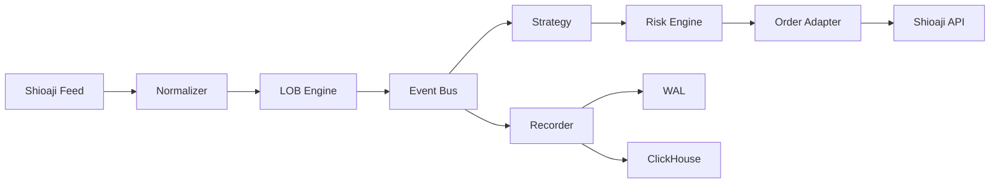

# HFT Platform — Full Project Reference

本文件嘗試把「專案所有內容」一次性整理成可查詢的完整索引。
若你只想快速上手，請先看：`docs/getting_started.md`。

---

## 1) 專案定位

HFT Platform 是一個事件驅動的交易系統：
- Feed → Normalize → LOB → Strategy → Risk → Order → Broker
- Recorder 會持續寫入 WAL / ClickHouse
- Rust Core 提供 hot path 加速

---

## 2) Repo 全覽（Top-Level Map）

| Path | Purpose |
| --- | --- |
| `.agent/` | Agent rules / prompts (IDE/AI workflow) |
| `.claude/` | Claude/Codex related config |
| `.github/` | CI workflows, PR templates |
| `.benchmarks/` | pytest-benchmark artifacts |
| `.venv/` | Local virtualenv (ignore in git) |
| `AGENTS.md` / `CLAUDE.md` | System/agent rules |
| `README.md` | Entry README |
| `config/` | 所有 config / env / symbols |
| `docs/` | 使用與運維文檔 |
| `scripts/` | 量測 / 模擬 / 診斷 / 工具腳本 |
| `src/` | 主程式碼 (`hft_platform`) |
| `rust_core/` | Rust 擴展 (PyO3) |
| `rust/` | Rust strategy / research crate |
| `tests/` | unit / integration / benchmark |
| `specs/` | 架構與設計規格 |
| `reports/` | latency / py-spy 等報告輸出 |
| `data/` | ClickHouse data / datasets |
| `.wal/` | WAL (jsonl) |
| `ops.sh` | Host tuning / setup / ops commands |
| `Makefile` | Optional convenience commands (dev/test/bench) |

---

## 3) Runtime Flow (High Level)



---

## 4) Core Runtime Modules (`src/hft_platform/`)

### 4.1 Entry & Main
- `main.py`: 啟動 `HFTSystem`
- `__main__.py`: `python -m hft_platform` 入口
- `cli.py`: CLI commands (`hft run`, `hft config`, etc.)

### 4.2 Feed Adapter
- `feed_adapter/shioaji_client.py`: 登入、訂閱、重連
- `feed_adapter/normalizer.py`: raw payload → `TickEvent` / `BidAskEvent`
- `feed_adapter/lob_engine.py`: 維護 LOB + stats

### 4.3 Event Bus
- `engine/event_bus.py`: lock‑free / low‑alloc event bus
- 控制參數見 `HFT_BUS_*`

### 4.4 Strategy
- `strategy/base.py`: BaseStrategy + StrategyContext
- `strategies/*`: 內建策略
- `strategy/runner.py`: dispatch / batching

### 4.5 Risk
- `risk/validators.py`: policy rules
- `risk/fast_gate.py`: Numba hot‑path check + kill switch (shared memory)

### 4.6 Execution / Orders
- `execution/router.py`: intent → adapter
- `execution/positions.py`: position tracking & PnL
- `order/adapter.py`: Shioaji order placement + rate limiter + circuit breaker

### 4.7 Recorder
- `recorder/writer.py`: WAL + ClickHouse batch writes
- `recorder/loader.py`: WAL → ClickHouse loader
- `recorder/converter.py`: WAL transform

### 4.8 IPC
- `ipc/shm_ring_buffer.py`: lock‑free shared memory ring buffer (SPSC)

### 4.9 Observability
- `observability/metrics.py`: Prometheus metrics

### 4.10 Contracts / Events / Core
- `contracts/`: strategy/execution contracts
- `events.py`: Tick/BidAsk/LOBStats events
- `core/`: pricing, ids, utilities

---

## 5) Rust Components

### 5.1 `rust_core/`
- PyO3 extension used for hot‑path acceleration
- Build (local):
  ```bash
  uv run maturin develop --manifest-path rust_core/Cargo.toml
  ```

### 5.2 `rust/`
- Separate crate (`rust_strategy`) for strategy research / acceleration

---

## 6) Config System (`config/`)

- `config/base/main.yaml`: default settings
- `config/env/<mode>/main.yaml`: sim/live overrides
- `config/env/<env>/main.yaml`: dev/staging/prod overlays
- `config/symbols.list` → `config/symbols.yaml`

詳細：`docs/config_reference.md`

---

## 7) CLI Overview

入口：`hft` / `python -m hft_platform`

常用：
```bash
hft run sim
hft run live
hft config build
hft config sync
hft strat test
hft backtest run
```

詳細：`docs/cli_reference.md`

---

## 8) Scripts (`scripts/`)

### 8.1 Latency Probes
- `scripts/latency/shioaji_api_probe.py` — Shioaji API latency/jitter
- `scripts/latency/e2e_clickhouse_report.py` — E2E latency + heatmap
- `scripts/latency_e2e_report.py` — per‑symbol latency heatmap

### 8.2 Simulation / Diagnostics
- `scripts/sim_full_pipeline.py` — full pipeline sim
- `scripts/sim_shioaji_stock_diag.py` — shioaji stock diagnostics
- `scripts/sim_shioaji_order_smoke.py` — order smoke test
- `scripts/sim_shioaji_futures_smoke.py` — futures smoke test
- `scripts/sim_futures_strategy_order.py` — futures strategy order test

### 8.3 Misc
- `scripts/benchmark_gate.py` — Darwin Gate regression check
- `scripts/verify_rust_deployment.py` — Rust extension verification
- `scripts/live_contract_cache_refresh.py` — refresh contracts cache
- `scripts/create_snapshot.py` / `batch_create_snapshots.py`

---

## 9) Internal Utility Scripts (`src/hft_platform/scripts/`)

- `generate_mass_config_sharded.py`: config sharding
- `generate_synthetic_hbt_data.py`: synthetic backtest data
- `generate_synthetic_mhp_data.py`: synthetic MHP data
- `generate_valid_config.py`: validate config file
- `monitor_latency.py`: monitor pipeline latency
- `record_learning.py`: record dataset
- `subscribe_futures.py`: futures subscription helper

---

## 10) Tests

### 10.1 Unit Tests (`tests/unit/`)
- contracts, risk fast gate, IPC ring buffer, CLI, etc.

### 10.2 Integration (`tests/integration/`)
- requires ClickHouse / Redis

### 10.3 Benchmarks (`tests/benchmark/`)
- pytest‑benchmark based
- baseline: `tests/benchmark/.benchmark_baseline.json`
 - key benches:
   - `micro_bench_fast_gate.py`
   - `micro_bench_lob.py`
   - `micro_bench_normalizer.py`
   - `micro_bench_rust_hotpath.py`
   - `test_rust_hotpath_benchmark.py`

Run locally:
```bash
uv run pytest tests/unit
uv run pytest tests/integration
uv run pytest tests/benchmark --benchmark-only
```

---

## 10.5 Optional Makefile Commands

If you prefer `make`, there is an optional `Makefile` with shortcuts:

```bash
make dev
make test
make coverage
make benchmark
```

See `Makefile` for the full list.

---

## 11) CI Pipeline (`.github/workflows/ci.yml`)

Stages:
1. Lint + Format (`ruff`)
2. Rust build + clippy + tests
3. mypy typecheck
4. Unit tests + coverage (fail under 70%)
5. Benchmark + Darwin Gate (threshold 10%)
6. Integration tests (ClickHouse + Redis)
7. Security scan (pip‑audit)

---

## 12) Observability

Metrics 入口：`http://localhost:9090/metrics`

重要指標：
- feed latency / jitter
- event loop lag
- queue depth
- order / execution metrics

詳細：`docs/observability_minimal.md`

---

## 13) Ops & Host Tuning

`ops.sh` commands:
- `setup` / `tune` / `hugepages` / `isolate`
- `monitor-ch` / `replay-wal`

詳細：`docs/hft_low_latency_runbook.md`

---

## 14) Specs / Research
- `specs/hft_simulation_architecture.md` — hardened digital twin design
- `research/` — experimental notebooks / prototypes (非 production)

---

## 15) Safety Rules (HFT Laws)
- No heap allocations on hot path
- SoA layout for locality
- No blocking I/O on event loop
- No float for price/PnL
- Zero‑copy across Python/Rust
